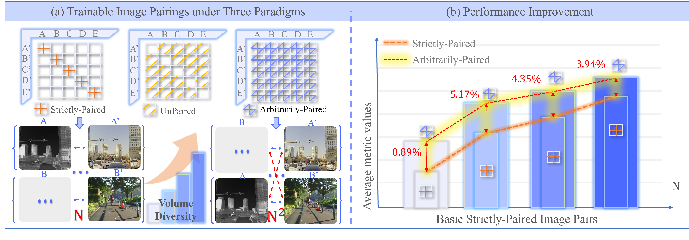

<!-- ===================================================================== -->
<!--  Beyond Strict Pairing: Arbitrarily Paired Training for
High-Performance Infrared and Visible Image Fusion – Testing Code & Visualization README                    -->
<!--  Edit-by: Yanglin Deng                              -->
<!-- ===================================================================== -->


#  Novel training
**Beyond Strict Pairing: Arbitrarily Paired Training for High-Performance Infrared and Visible Image Fusion**
Yanglin Deng, Tianyang Xu, Chunyang Cheng, Hui Li, Xiao-Jun Wu and Josef Kittler in CVPR 2026
## 📖 Paper Overview
We propose a **novel training paradigm** which fundamentally alleviates the cost and difficulty of data collection while enhancing model robustness from the data perspective, delivering a feasible solution for IVIF studies. 


  
**(a)** Compared with the strictly-paired paradigm, the two proposed paradigms lift the requirement for spatiotemporally aligned pairs, expanding the trainable pairs to $N\times(N-1)$ and $N^2$, respectively, reducing data-collection costs and improving generalisation.

**(b)** Performance improvement pattern: greater enhancement from $N^2$ for smaller $N$.

## 🗂️ Training essence of proposed UPTP
  

## 🗂️ Pre-trained Weights & Evaluation(IVIF and Segmentation tasks on MSRS; Detection task on M³FD)

### Comprehensive comparison with SOTAs

| Method    | Checkpoint                                                                                                       | MB↓ | EN↑ | MI↑ | VIF↑ | Qabf↑ | SSIM↑ | SD↑ | NIQ↓ | BRI↓ | SF↑ | miou↑ | @.5:.95↑ |
|:----------|:-----------------------------------------------------------------------------------------------------------------| ---: | ---: | ---: | ---: | ---: | ---: | ---: | ---: | ---: | ---: | ---: | ---: |
| **LRR**   | [LRRNet](https://github.com/hli1221/imagefusion-LRRNet)                                                                                                       | 0.19 | 6.19 | 2.03 | 0.54 | 0.45 | 0.71 | 31.76 | 3.37 | 31.36 | 3.98 | 75.25 | 0.186 |
| **Meta**  | [MetaFusion](https://github.com/wdzhao123/MetaFusion)                                                            | 3.10 | 6.37 | 1.16 | 0.71 | 0.48 | 0.78 | 39.64 | 4.28 | 41.13 | 5.45 | 74.07 | 0.167 |
| **DDF**   | [DDFM](https://github.com/Zhaozixiang1228/MMIF-DDFM)                                                             | 2108 | 6.17 | 1.89 | 0.74 | 0.47 | 0.91 | 28.92 | 2.98 | 31.92 | 3.91 | 73.83 | - |
| **Cros**  | [CrossFuse](https://github.com/hli1221/CrossFuse)                                                                | 79.40 | 6.49 | 2.17 | 0.84 | 0.56 | 0.88 | 36.31 | 3.25 | 33.17 | 4.23 | 73.53 | 0.185 |
| **CTH**   | [CTHIE](https://github.com/yuliu316316/IVF-WoReg)                                                                                                        | 53.89 | 5.64 | 1.45 | 0.43 | 0.35 | 0.47 | 34.45 | 4.05 | 35.38 | 3.79 | - | - |
| **DCI**   | [DCINN](https://github.com/wwhappylife/DCINN)                                                                    | 9.77 | 6.00 | 2.30 | 0.82 | 0.57 | 0.73 | 40.30 | 3.25 | 35.99 | 4.61 | 74.72 | 0.188 |
| **MRF**   | [MRFS](https://github.com/HaoZhang1018/MRFS)                                                                     | 1546 | 6.51 | 1.68 | 0.65 | 0.47 | 0.74 | 38.63 | 3.51 | 35.31 | 3.90 | 75.52 | 0.166 |
| **Free**  | [FreeFusion](https://github.com/HengshuaiCui/FreeFusion)                                                         | 65.19 | 5.16 | 1.38 | 0.51 | 0.42 | 0.43 | 41.14 | 3.61 | 37.99 | 4.93 | 65.42 | 0.196 |
| **SAGE**  | [SAGE](https://github.com/RollingPlain/SAGE_IVIF)                                                                | 0.55 | 6.00 | 2.23 | 0.71 | 0.54 | 0.88 | 36.34 | 3.25 | 32.23 | 4.38 | 74.96 | 0.185 |
| **GIF**   | [GIFNet](https://github.com/AWCXV/GIFNet)                                                                        | 3.25 | 5.94 | 1.36 | 0.58 | 0.42 | 0.85 | 32.93 | 4.79 | 38.16 | 4.22 | 75.40 | 0.167 |
| **CNN**   | [CNN_baseline.model](https://github.com/yanglinDeng/IVIF_unpair/tree/main/pretrained_models/CNN/CNN.model)       | 0.81 | **6.58** | **2.69** | **0.93** | **0.65** | **1.00** | 41.52 | **3.15** | 33.74 | 4.44 | **75.47** | 0.193 |
| **Trans** | [Trans_baseline.model](https://github.com/yanglinDeng/IVIF_unpair/tree/main/pretrained_models/Trans/Trans.model) | 0.81 | **6.57** | **2.64** | **0.92** | **0.65** | 0.98 | 41.36 | **3.13** | **31.25** | 4.47 | **75.57** | **0.197** |
| **GAN**   | [GAN_baseline.model](https://github.com/yanglinDeng/IVIF_unpair/tree/main/pretrained_models/GAN/GAN.model)       | 0.71 | **6.57** | **2.53** | **0.91** | **0.63** | **1.01** | **41.90** | **3.09** | 32.46 | 4.47 | **75.62** | **0.207** |


## 🚀 Quick Start
### 1. 📥 Clone
git clone https://github.com/yanglin/IVIF_unpair.git
cd IVIF_unpair

### 2.🛠️ Environment
```bash
conda create -n unpair python=3.7.3
conda activate unpair
pip install -r requirements.txt
```

### 3.🏆 Performance Testing of three baseline models

```bash
python test.py 
```

### 4. 🧪 Training of strictly-paired images

```bash
python train_pair.py
```
### 5. ⚡ Training of unpaired or arbitrarily-paired images
```bash
python train_unpair.py
```

⭐ If this repo helps your research, please give us a star! ⭐


## Contact Informaiton
If you have any questions, please contact me at <yanglin_deng@163.com>.
